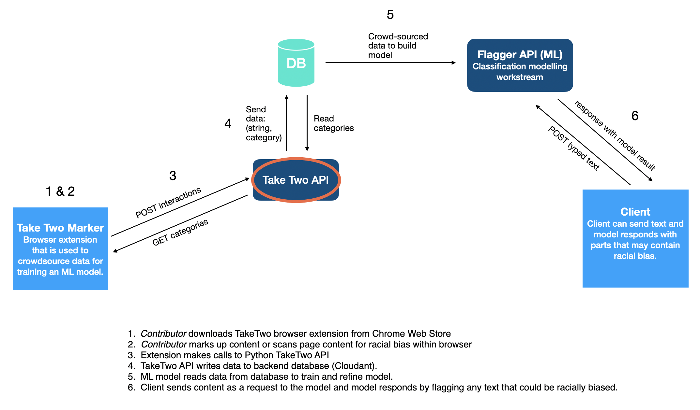
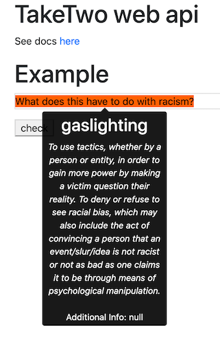
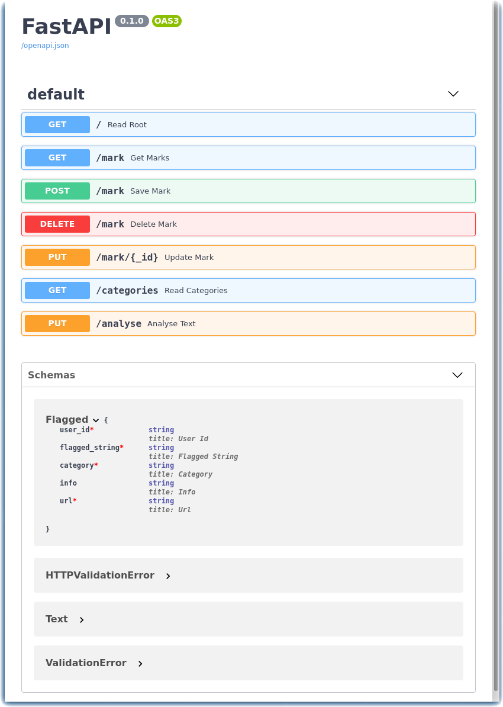

# TakeTwo Solution Starter - WebAPI Backend

The TakeTwo Web API can be used while you compose social media text, paragraphs, essays and papers. TakeTwo will scan for potentially racially biased language. The API is built using Python, [FastAPI](https://fastapi.tiangolo.com/), and [Docker](https://www.docker.com) (if running on a Kubernetes cluster).

The racially biased terms are vetted and loaded into a backend database. The code is set up to run the API locally with a [CouchDB](https://couchdb.apache.org/) backend database or [IBM Cloudant](https://www.ibm.com/uk-en/cloud/cloudant) database.

To run with CouchDB, you will need to deploy a CouchDB docker image either locally or on a Kubernetes cluster.

There is a front-end HTML page that serves as an example text editor.

## Diagrams

### TakeTwo Architecture

This API (highlighted in the following diagram) is part of the Call for Code for Racial Justice TakeTwo Project. This API is used to capture the data highlighted by users through the TakeTwo Chrome extension tool.



</br>

### Description of TakeTwo API

This API is part of the Call for Code for Racial Justice TakeTwo project. This API is used to capture the data crowdsourced by our contributors through the [TakeTwo Chrome extension tool](https://github.com/Call-for-Code-for-Racial-Justice/taketwo-marker-chromeextension/blob/main/README.md).

The API is used to fetch the defined categories of racial bias and serve them in the extension tool. It also captures the data highlighted by contributors and posts it to a backend database. This data is used to train an [ML model](https://github.com/Call-for-Code-for-Racial-Justice/taketwo-datascience/blob/main/README.md) that can detect racial bias.

## Datasets

The database contains the following fields:

- ``"_id"``: *Database field* (optional)
- ``"_rev"``: *Database field*
- ``"user_id"``: *The user ID*
- ``"flagged_string"``: *The word or phrase that has been highlighted by the user.*
- ``"category"``: *The category that has been selected for the type of racial bias present in the highlighted word or phrase.*
- ``"info"``: *Additional information; context description provided by the user.* (optional)
- ``"url"``: *The url from where the word or phrase was highlighted.*


</br>

This project has defined a number of categories of racial bias, which are used by a text classification model (outlined below). We welcome feedback on these:

- Appropriation
- Stereotyping
- Under-Representation
- Gaslighting
- Racial Slur
- Othering

Definitions of these categories can be found on the TakeTwo [webpage](https://github.com/Call-for-Code-for-Racial-Justice/TakeTwo/blob/main/README.md).

</br>

## Learning objectives

In this tutorial, you will learn how to:
- Clone the TakeTwo repository.
- Install the Python prerequisites.
- Start a CouchDB container.
- Launch the application.
- Deploy to Kubernetes.
- Use the API.

## Prerequisites

To complete the steps in this tutorial you need:
- Install Python3
- Install Docker

## Estimated time

Completing this tutorial should take about 15 minutes.

## Getting started

#### Clone the TakeTwo repository

To run this API locally you will need to clone this repo:

```git clone https://github.com/embrace-call-for-code/taketwo-webapi.git```

#### Install the Python prerequisites

Navigate into the repo:

```cd taketwo-webapi```

Run the following command to create a virtual environment:

```python3 -m venv env```

Activate virtual environment:

```source env/bin/activate```

Install the packages needed from the requirements.txt file:

```pip install -r requirements.txt```

Navigate to the folder which contains the API code:

```cd taketwo-webapi```

#### Start a CouchDB container
Before launching the application, set the name of your CouchDB database.

Before launching the application, set the name of your CouchDB database:

```export DBNAME=taketwodatabase```

To run the API with a CouchDB backend, start a couchDB container before running the main.py code:

```docker run -p 5984:5984 -d -e COUCHDB_USER=admin -e COUCHDB_PASSWORD=password couchdb```

#### Configure the application
Copy `.env.sample` file to `.env` file in the same directory. Fill out the CouchDB database and IBM App Id service credentials.

```
#CouchDB Credentials
DB_HOST=
DB_PORT=
DB_NAME=
DB_USERNAME=
DB_PASSWORD=

#IBM AppID Credentials
CLIENT_ID=
SECRET=
OAUTH_SERVER_URL=
```

#### Launch the application

Run the Python api code:

```uvicorn main:app --reload```

</br>

## Deploy to Kubernetes

There is already an [image](https://hub.docker.com/repository/docker/josiemundi/taketwo_v0.1) available in Docker Hub for this API, which you can use to deploy to a Kubernetes cluster. Alternatively, you can build your own using the Dockerfile in this repo.

To build a new image, run the following command in a terminal window:

```docker build -t <dockerusername>/taketwo_api .```

To push the image to Docker Hub, run the following:

```docker login```
```docker push <dockerusername>/taketwo_api```

</br>

## Use the API

When the API is running, the main url will show an example text editor which can be used to make requests to the backend data. You can type in the text box and then press check. Text that could be racially biased will be highlighted as shown in the following example.

Open a browser to [http://localhost:8000](http://localhost:8000)

</br>



## Review the TakeTwo OpenAPI documentation

For an overview of the available endpoints, navigate to [http://localhost:8000/docs](http://localhost:8000/docs)



### Contributing

We welcome contributions! For details on how to contributing please read the [CONTRIBUTING](CONTRIBUTING.md) file in this repo.

This project is still very much a work in progress, however our hope for the future is that this is a step towards a more informed media culture that is more aware of racial bias in media content. We hope this can be built out so that it can be used in a range of areas; news, social media, forums, code etc.

We also hope to expand the project to enable detection of racial bias in audio and video in the future.
Before launching the application, set the name of your CouchDB database.

We hope you will help us in this open source community effort!

## Authors

- User Researcher: Anna Rodriguez
- Designers: Naagma Timakondu, Sbusiso Mkhombe
- Tester: Merlina Escorcia
- Generalist: Ashley West, Jashu Gorsia, Yolanda Rabun
- Data Scientists: Naoki Abe, Alayt Issak
- Lead Developer: Johanna Saladas
- Architect: Steve Uniack
- Offering Manager: Iain McCombe

## Documents

[Media Representations Impact Black Men](https://www.opportunityagenda.org/explore/resources-publications/media-representations-impact-black-men/media-portrayals)

## Disclosures

## License

This solution starter is made available under the [MIT License](LICENSE).
